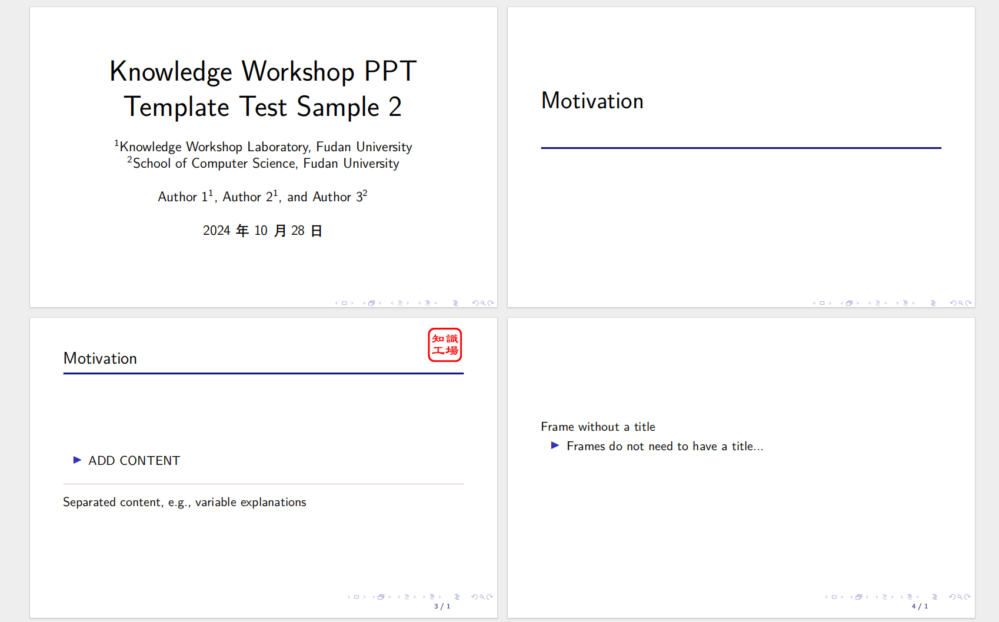

# 知识工场LaTeX PPT模板

一直以来有一个目标，想为自己和同学准备一些非常漂亮、学术化的LaTeX PPT模板，所以本项目是为知识工场实验室同学所准备的LaTeXPPT模板。
目前LaTeX刚开始进行，之后希望有需要的同学陆续添加或修改提交相关requests修改相关内容。

目前有以下的样式：
<table>
  <tr>
    <td></td>
    <td></td>
  </tr>
  <tr>
    <td></td>
    <td></td>
  </tr>
  <tr>
    <td></td>
    <td></td>
  </tr>
</table>

非常欢迎同学提交requests！
# Overleaf 使用方式
1. [样式一](https://www.overleaf.com/read/zdvbqghvjgfs#d1613a)
2. [样式二](https://www.overleaf.com/read/pgsdgpxfxqww#f535d7)
3. [样式三](https://www.overleaf.com/read/fydcmkpkpkzp#5a1138)
注意中文样式只支持`XeTeX`引擎，`pdflatex`引擎编译会有问题。

使用的同学需要将对应的LaTeX PPT模板导入到自己的Overleaf项目中即可。
# License
本项目遵循 GPL Version 3.0
